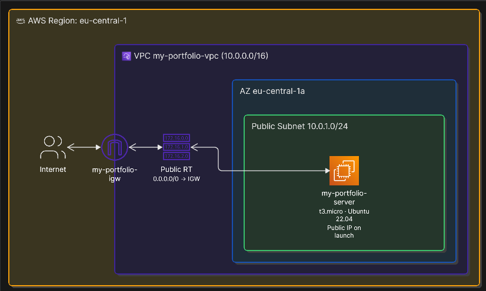
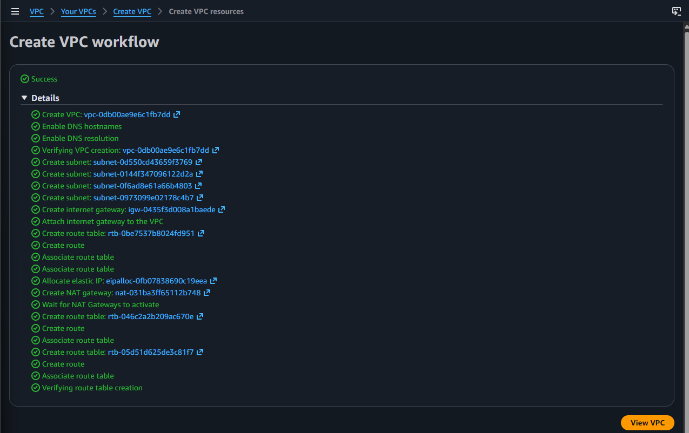
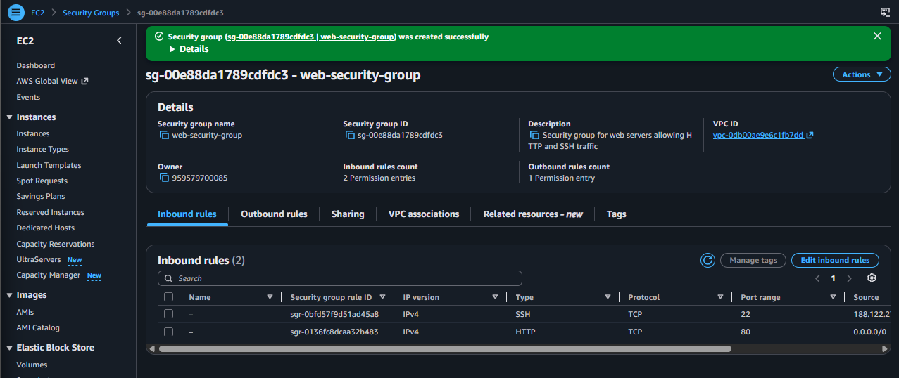
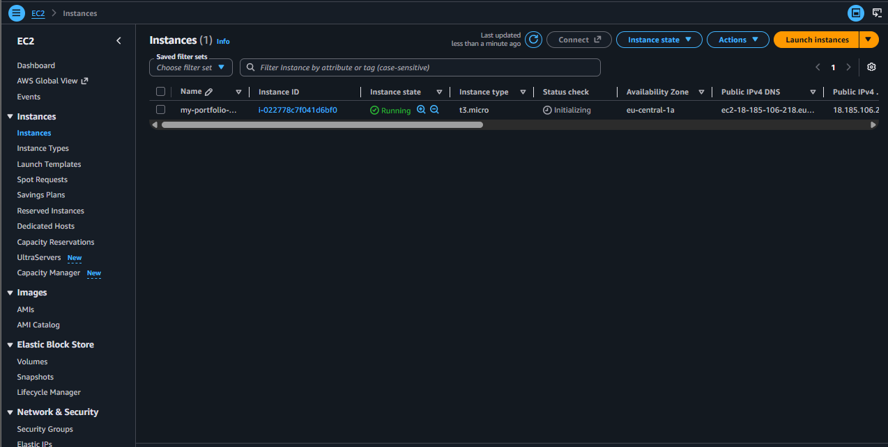
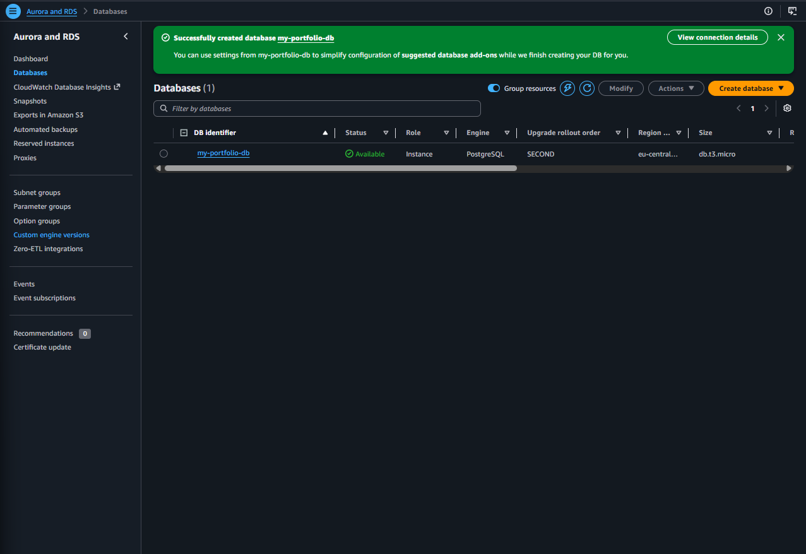
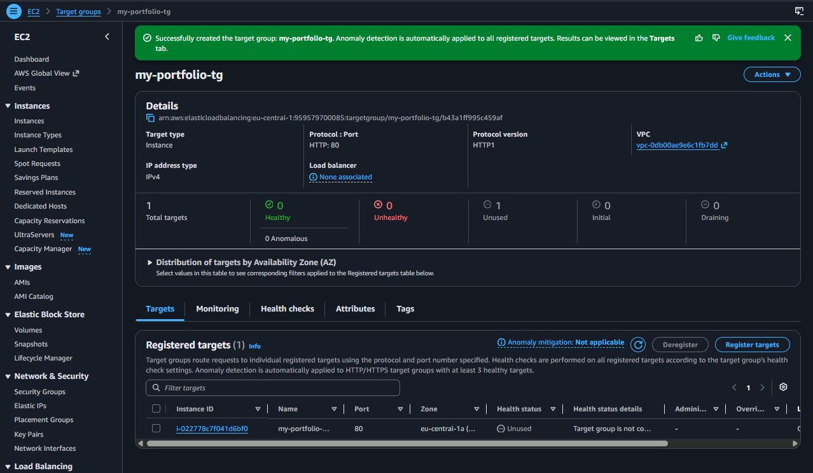

# AWS Infrastructure Portfolio (Terraform)

This project showcases a secure, modular, and scalable AWS cloud infrastructure built from scratch using **Infrastructure as Code (IaC)** principles with **Terraform**. It transitions manual cloud management into a repeatable, version-controlled architecture.

---

## 🏛️ Architecture Diagram

The following diagram illustrates the network topology and component relationships deployed in the **AWS Frankfurt (`eu-central-1`)** region:

  

---

## 📂 Project Structure & Component Overview

The project is refactored into modular configuration files to maintain high readability, separation of concerns, and best practices in modern IaC:

- **`main.tf`**: Core networking infrastructure. Configures the isolated Virtual Private Cloud (`my-portfolio-vpc`, `10.0.0.0/16`), the Internet Gateway (`my-portfolio-igw`), the public subnet (`10.0.1.0/24` in `eu-central-1a`), route tables, and route table associations ensuring proper public internet routing.
- **`variables.tf`**: Parameterization layer. Houses configurable input variables such as the AWS region, CIDR blocks, and availability zones, making the infrastructure flexible and reusable across environments.
- **`ec2.tf`**: Compute layer. Dynamically queries and retrieves the latest official Ubuntu 22.04 LTS AMI and provisions a cost-effective `t3.micro` instance inside the public subnet with an automatically assigned public IP address.

---

## 📸 Component Snapshots & Verification

### 1. Networking & VPC
A dedicated Virtual Private Cloud provides complete network isolation. The workflow automatically provisions public and private subnets, an Internet Gateway, Route Tables, and DNS settings.

  

---

### 2. Security Groups
Stateful virtual firewalls control inbound and outbound traffic. Configured to allow secure administrative access via SSH (`Port 22`) and web traffic via HTTP (`Port 80`).

  

---

### 3. Compute Instance - EC2
An Amazon EC2 instance serves as the core web server node (`t3.micro` running Ubuntu), deployed directly into the public subnet.

  

---

### 4. Relational Database - Amazon RDS
A managed PostgreSQL relational database instance (`my-portfolio-db`) providing backend data persistence with automated backups and high availability.

  

---

### 5. Load Balancing - Target Group
A Target Group (`my-portfolio-tg`) routing incoming web traffic to registered EC2 instances using HTTP protocol on port 80.

  

---

## 🎯 Use Cases

This architecture serves as a foundation for multiple real-world scenarios:
- **Portfolio / Web Hosting**: Deploying personal websites, portfolios, or lightweight applications accessible directly via the public internet.
- **CI/CD Testing Ground**: Serving as a test bed for automated continuous integration and continuous deployment pipelines targeting cloud infrastructure.
- **Microservices Playground**: Providing a clean, isolated network foundation that can be expanded with private subnets, databases (RDS), and load balancers.

---

## 💡 What I Learned from This Project

Building this infrastructure provided hands-on experience across several critical DevOps and cloud engineering domains:
- **Infrastructure as Code (IaC)**: Moving away from manual AWS console click-ops to declarative, version-controlled code using Terraform.
- **Modularization & Refactoring**: Splitting a monolithic configuration file into specialized files (`main.tf`, `variables.tf`, `ec2.tf`) to improve code maintainability and scalability.
- **AWS Networking Fundamentals**: Designing a secure custom VPC from the ground up, including subnets, Internet Gateways, route tables, and DNS resolution settings.
- **Dynamic Resource Provisioning**: Utilizing Terraform Data Sources (`aws_ami`) to automatically fetch the latest secure operating system images rather than hardcoding static IDs.
- **Security & State Management**: Implementing best practices like configuring local AWS CLI authentication profiles, avoiding hardcoded secrets, and properly utilizing `.gitignore` to keep sensitive local state files out of public version control.